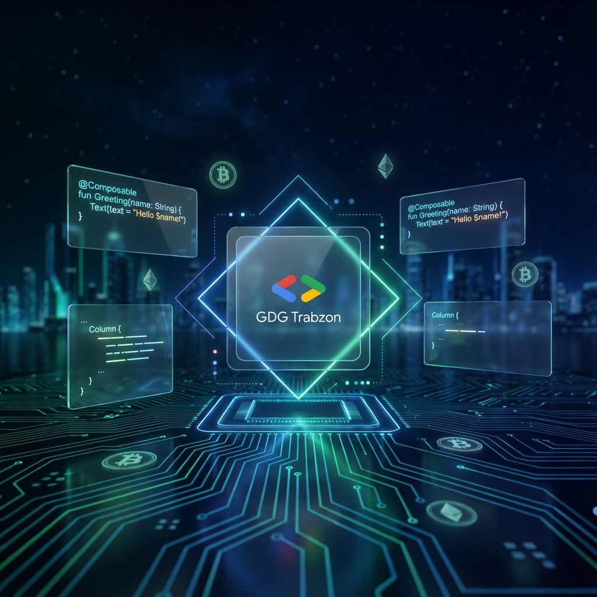
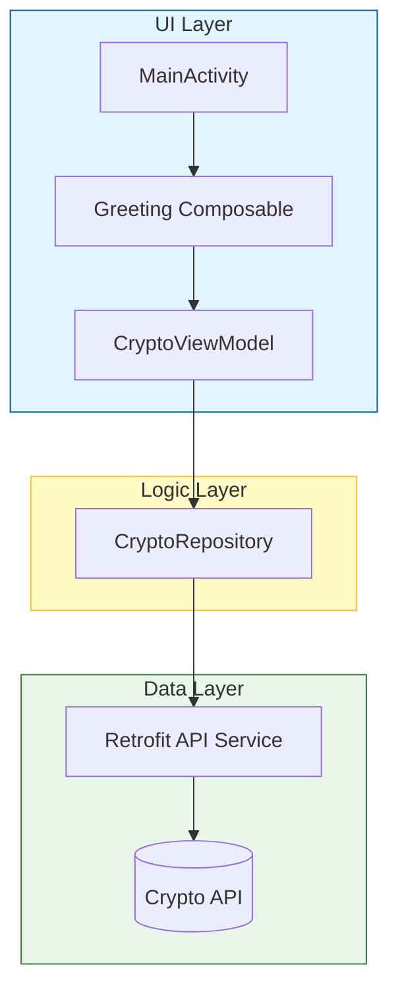

# 🚀 GDG Trabzon - Android Crypto Atölyesi

> **Status:** 🟢 Active Workshop | **Version:** v1.0.0 | **Arch:** MVVM + Compose

Bu depo, GDG Trabzon tarafından düzenlenen Android geliştirme atölyesi için hazırlanmış kapsamlı bir eğitim materyalidir. Katılımcılar, modern Android araçlarını kullanarak gerçek zamanlı bir kripto para takip uygulaması geliştirmeyi öğreneceklerdir.

---

## 🛠 Teknik Dashboard

| Feature | Provider | Status |
| :--- | :--- | :--- |
| **Language** | Kotlin (1.9+) | ✅ Ready |
| **UI Framework** | Jetpack Compose | ✅ Implemented |
| **Architecture** | MVVM (Cleanish) | ✅ Setup |
| **Network** | Retrofit 2 + Coroutines | ✅ Integrated |
| **State Management** | StateFlow / CollectAsState | ✅ Active |

---

## 📐 Mimari ve Veri Akışı

Proje, Google'ın önerdiği modern Android mimarisi (MVVM) üzerine inşa edilmiştir.



---

## 📚 Atölye Yol Haritası (Milestones)

- [x] **M1: Proje Kurulumu** - Android Studio ve kütüphane bağımlılıklarının yapılandırılması.
- [x] **M2: API Entegrasyonu** - Retrofit ve veri modellerinin (POJO) oluşturulması.
- [x] **M3: İş Mantığı** - ViewModel ve Repository katmanlarının tasarımı.
- [/] **M4: Görsel Tasarım** - Compose ile modern ve dinamik listelerin oluşturulması.
- [ ] **M5: Detay Sayfası** - Seçili kripto paranın detaylarını gösterme (Planlanan).

---

## ⚙️ Kurulum (Quick Start)

1. Bu depoyu clonlayın:
   ```bash
   git clone https://github.com/bahattinyunuscetin/gdg_atolye.git
   ```
2. Android Studio (Ladybug veya üstü) ile projeyi açın.
3. Gradle senkronizasyonunun tamamlanmasını bekleyin.
4. Bir emülatör veya gerçek cihaz üzerinde çalıştırın.

---

## 🤝 Katkıda Bulunma

Hataları bildirmek veya yeni özellikler önermek için lütfen [CONTRIBUTING.md](CONTRIBUTING.md) dosyasını inceleyin.

---

## 📄 Lisans

Bu proje [MIT Lisansı](LICENSE) altında lisanslanmıştır.

---

<p align="center">
  <b>GDG Trabzon Topluluğu tarafından ❤️ ile geliştirilmiştir.</b><br>
  <a href="https://gdg.community.dev/gdg-trabzon/">Topluluk Sayfamız</a> • <a href="https://twitter.com/gdgtrabzon">Twitter</a>
</p>
