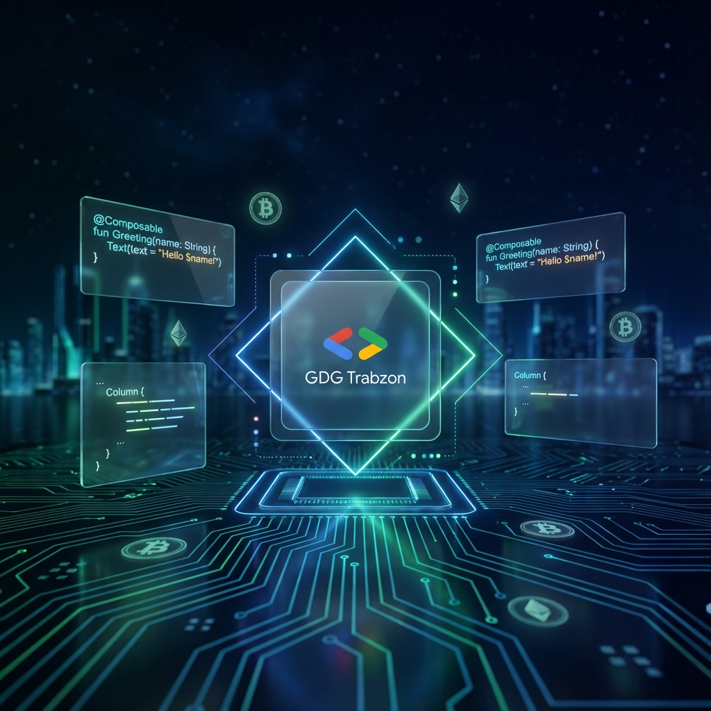
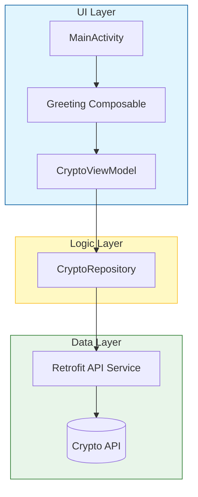

# 🚀 GDG Trabzon - Android Crypto Atölyesi

> **Status:** 🟢 Active Workshop | **Version:** v1.0.0 | **Arch:** MVVM + Compose

Bu depo, GDG Trabzon tarafından düzenlenen Android geliştirme atölyesi için hazırlanmış kapsamlı bir eğitim materyalidir. Katılımcılar, modern Android araçlarını kullanarak gerçek zamanlı bir kripto para takip uygulaması geliştirmeyi öğreneceklerdir.

---

## 🛠 Teknik Dashboard

| Feature | Provider | Status |
| :--- | :--- | :--- |
| **Language** | Kotlin (1.9+) | ✅ Ready |
| **UI Framework** | Jetpack Compose | ✅ Implemented |
| **Architecture** | MVVM (Cleanish) | ✅ Setup |
| **Network** | Retrofit 2 + Coroutines | ✅ Integrated |
| **State Management** | StateFlow / CollectAsState | ✅ Active |

---

## 📐 Mimari ve Veri Akışı

Proje, Google'ın önerdiği modern Android mimarisi (MVVM) üzerine inşa edilmiştir.


```mermaid
graph TD
    subgraph UI_Layer [UI Layer]
        MainActivity --> Greeting[Greeting Composable]
        Greeting --> CryptoViewModel
    end

    subgraph Logic_Layer [Logic Layer]
        CryptoViewModel --> CryptoRepository
    end

    subgraph Data_Layer [Data Layer]
        CryptoRepository --> Retrofit[Retrofit API Service]
        Retrofit --> ExternalAPI[(Crypto API)]
    end

    style UI_Layer fill:#e1f5fe,stroke:#01579b
    style Logic_Layer fill:#fff9c4,stroke:#fbc02d
    style Data_Layer fill:#e8f5e9,stroke:#2e7d32
```

---

## 📚 Atölye Yol Haritası (Milestones)

- [x] **M1: Proje Kurulumu** - Android Studio ve kütüphane bağımlılıklarının yapılandırılması.
- [x] **M2: API Entegrasyonu** - Retrofit ve veri modellerinin (POJO) oluşturulması.
- [x] **M3: İş Mantığı** - ViewModel ve Repository katmanlarının tasarımı.
- [x] **M4: Görsel Tasarım** - Compose ile modern ve dinamik listelerin oluşturulması.
- [x] **M5: Detay Sayfası** - Seçili kripto paranın detaylarını gösterme.

---

## ⚙️ Kurulum (Quick Start)

1. Bu depoyu clonlayın:
   ```bash
   git clone https://github.com/bahattinyunuscetin/gdg_atolye.git
   ```
2. Android Studio (Ladybug veya üstü) ile projeyi açın.
3. Gradle senkronizasyonunun tamamlanmasını bekleyin.
4. Bir emülatör veya gerçek cihaz üzerinde çalıştırın.

---

## 🤝 Katkıda Bulunma

Hataları bildirmek veya yeni özellikler önermek için lütfen [CONTRIBUTING.md](CONTRIBUTING.md) dosyasını inceleyin.

---

## 📄 Lisans

Bu proje [MIT Lisansı](LICENSE) altında lisanslanmıştır.

---

## 👨‍💻 Hazırlayan

**Bahattin Yunus Çetin**  
*IT Architect*

Akademik eğitimine Trabzon Üniversitesi Of Teknoloji Fakültesi'nde devam eden Bahattin Yunus Çetin, yazılım mimarisi ve sistem tasarımı alanlarında yetkinlik sahibidir. Bu proje, modern yazılım geliştirme pratiklerini ve mimari disiplini bir araya getirme vizyonuyla kendisi tarafından hazırlanmıştır.

<div align="left">
  <a href="https://github.com/bahattinyunus">
    
  </a>
  <a href="https://www.linkedin.com/in/bahattinyunus/">
    
  </a>
</div>

---

<p align="center">
  <b>GDG Trabzon Topluluğu tarafından ❤️ ile geliştirilmiştir.</b><br>
  <a href="https://gdg.community.dev/gdg-trabzon/">Topluluk Sayfamız</a> • <a href="https://twitter.com/gdgtrabzon">Twitter</a>
</p>
